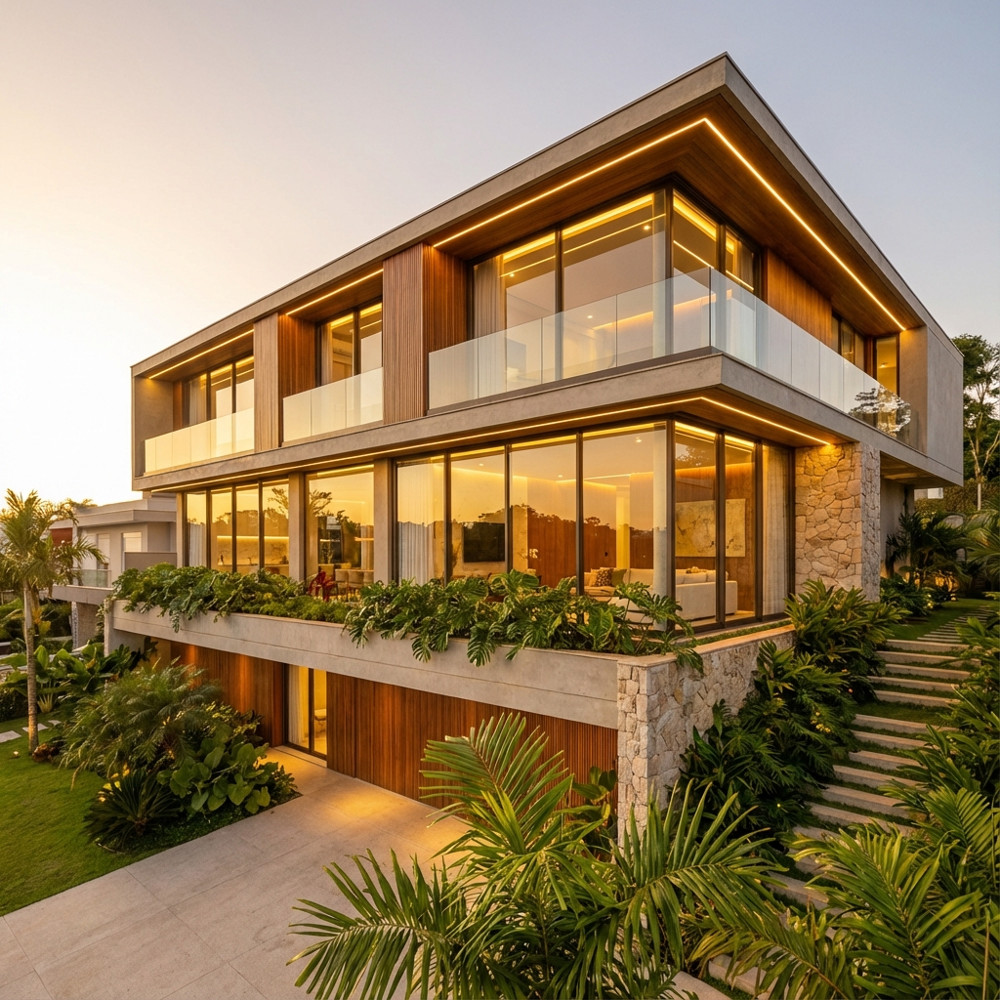

# ARCHI-TECH PLATFORM



## 🌟 Overview

**ARCHI-TECH PLATFORM** is a high-performance, visually stunning landing page designed for a modern Architecture Firm. It seamlessly blends the precision of **Artificial Intelligence** with the ancient harmony of **Vastu Shastra**.

Built with the latest web technologies, this platform offers an immersive user experience through interactive reveal effects, smooth scroll animations, and a premium "Tech-Zen" aesthetic.

## 🚀 Tech Stack

-   **Framework:** [Next.js 14](https://nextjs.org/) (App Router)
-   **Styling:** [Tailwind CSS](https://tailwindcss.com/)
-   **Animations:** [Framer Motion](https://www.framer.com/motion/)
-   **Icons:** [Lucide React](https://lucide.dev/)
-   **Fonts:**
    -   *Headers:* `Playfair Display` (Luxury/Classic)
    -   *Body:* `Inter` (Clean/Modern)

## ✨ Key Features

### 1. 🔦 Interactive Hero Section
-   **Concept:** "Designing Destiny"
-   **Effect:** A unique "flashlight" reveal interaction. Moving the mouse cursor reveals a photorealistic architectural rendering ("Reality") hidden beneath a wireframe blueprint ("AI Precision").
-   **Implementation:** Uses Framer Motion for real-time cursor tracking and masking.

### 2. 🍱 Services Grid (Bento-Box Layout)
-   **Design:** A modern, grid-based layout showcasing core services.
-   **Visuals:** Glassmorphism cards that glow on hover.
-   **Content:**
    -   AI-Driven Architecture
    -   Vastu Shastra Consulting
    -   Holistic Planning
    -   Interior Design

### 3. ⏳ The Process Timeline
-   **Structure:** A vertical timeline illustrating the project lifecycle.
-   **Flow:** From "AI Site Analysis" to "Execution".
-   **Animation:** Elements fade in and slide into view as the user scrolls.

### 4. 📩 Minimalist Contact Section
-   **Background:** An abstract topological map pattern (SVG) adding depth without distraction.
-   **Form:** A clean, functional contact form with `suppressHydrationWarning` implemented for stability.

## 🎨 Design System

The project follows a strict "Tech-Zen" theme:

-   **Colors:**
    -   `Charcoal (#1a1a1a)`: Represents depth, AI, and sophistication.
    -   `Gold (#d4af37)`: Represents luxury, Vastu, and warmth.
-   **Typography:**
    -   Combines the elegance of serif headings with the readability of sans-serif body text.

## 🛠️ Installation & Setup

Follow these steps to run the project locally:

1.  **Clone the repository** (if applicable) or navigate to the project directory:
    ```bash
    cd archi-tech-platform
    ```

2.  **Install dependencies:**
    ```bash
    npm install
    ```

3.  **Run the development server:**
    ```bash
    npm run dev
    ```

4.  **Open the application:**
    Visit [http://localhost:3000](http://localhost:3000) in your browser.

## 📁 Project Structure

```
archi-tech-platform/
├── app/
│   ├── layout.tsx       # Root layout with fonts & Navbar
│   ├── page.tsx         # Main landing page composition
│   └── globals.css      # Global styles & Tailwind theme
├── components/
│   ├── Navbar.tsx       # Responsive navigation
│   ├── Hero.tsx         # Interactive hero section
│   ├── Services.tsx     # Services grid
│   ├── Process.tsx      # Timeline component
│   └── Contact.tsx      # Contact form
├── public/
│   └── images/          # Static assets (Hero images)
├── tailwind.config.ts   # Tailwind configuration
└── package.json         # Dependencies & scripts
```

## 🔧 Customization

You can easily customize the theme in `app/globals.css` (using Tailwind v4 theme variables) or `tailwind.config.ts` depending on your setup.

**Colors:**
-   `--color-charcoal`: Change this to update the primary background color.
-   `--color-gold`: Change this to update the accent color.

## 📄 License

This project is available for personal and commercial use.
